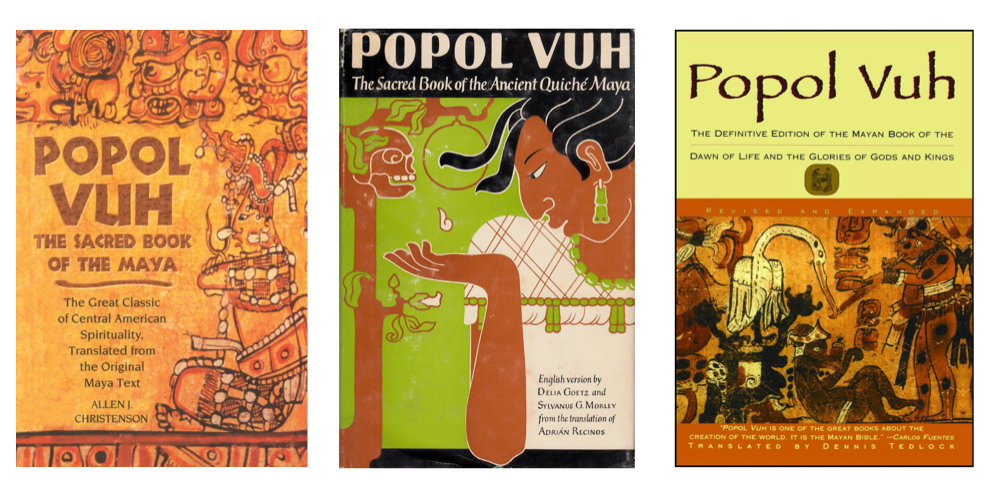

# An Analysis of Multiple Translations of *The Popol Vuh*

Across popular film and media, I noticed that we tend to see the Maya civilization depcited as violent and barbaric. Often times, however, these are misrepresetnations of what we actually know about this civilization and their achievments in science, mathematics and astronomy. Similarly, historians are discovering that the Maya were likely more violent than previosly thought, but there's still discussion as to what their motivations for war may have been. I believe there is still room for careful analysis of this civilization's values and beliefs to better understand if acts of violece were in fact a pillar in their society. More importantly, if violence is prominent, what was their reasoning behind it? It is important to reasses how we are portraying this civilization in modern media and how we continue with research on this topic because continual misrepresentation of this civilization casts a negative and inappropriate light on members of current Maya communities. Additionally, if we misinterpret their reasonings, values, and culture, we may still have limited knowledge of how they developed their breakthroughs in science, mathematics, and astronomy. Lastly, by developing a better understanding of their emphasis on violence and warfare in
their culture, we may recognize our own civilization’s values and how we exemplify them in our society. I believe an analysis of one of their most sacred texts, *The Popol Vuh*, would provide some insight as to what role violence played in their society. This text describes the story of creation for the Quiché Maya people through historical, mythological and religious contexts. Since it continues to play an important role in current Maya communities, I believe it is a great source to better understand their ancient civilization's values. 

In my research, I looked for violent language and topics amongst three translations of *The Popol Vuh* using CountVectorizer, term frequency–inverse document frequency (TF-IDF) scores, and topic modeling with the Latent Dirichlet Allocation (LDA) model. I also looked for variation in the use of violent language acorss the three translations to see if any discrepency influenced how the Maya were portrayed in the media. What I found is that negative language makes up about 4% of the actual text, however, even the presence of these negative words must be looked at in terms of the text's context. In addition, there was very little that made one text distinct from the other, and the discrepncy in word frequencies was likely due to the different lengths of the text--two of the three texts inncluded commentary. I also found that most of the topics deal with the narrative of creation told in the text, but some topics did appear slightly more violent that others. Similarly, however, we must consider the context of this seemingly negative topic, otherwise we will continue this process of misrepresentation and misinterpretation that we see in the media. Overall, this research provided an objective textual analysis of *The Popol Vuh*, but more work--such as refined texts and a close reading--is needed to uncover whether or not themes of violence are prevelant in the text and to understand their reasoning. 

The Popol Vuh Translation by Dennis Tedlock image: http://elorigendelavida1cc.blogspot.com/ 
The Popol Vuh Translation by Allen J Christenson image: https://www.goodreads.com/book/show/26839621-popol-vuh 
The Popol Vuh Translation by Delia Goetz & Sylvannus G Morley image: https://www.amazon.com/Popol-Vuh-Sacred-Ancient-Quiche/dp/B000J0SH10
